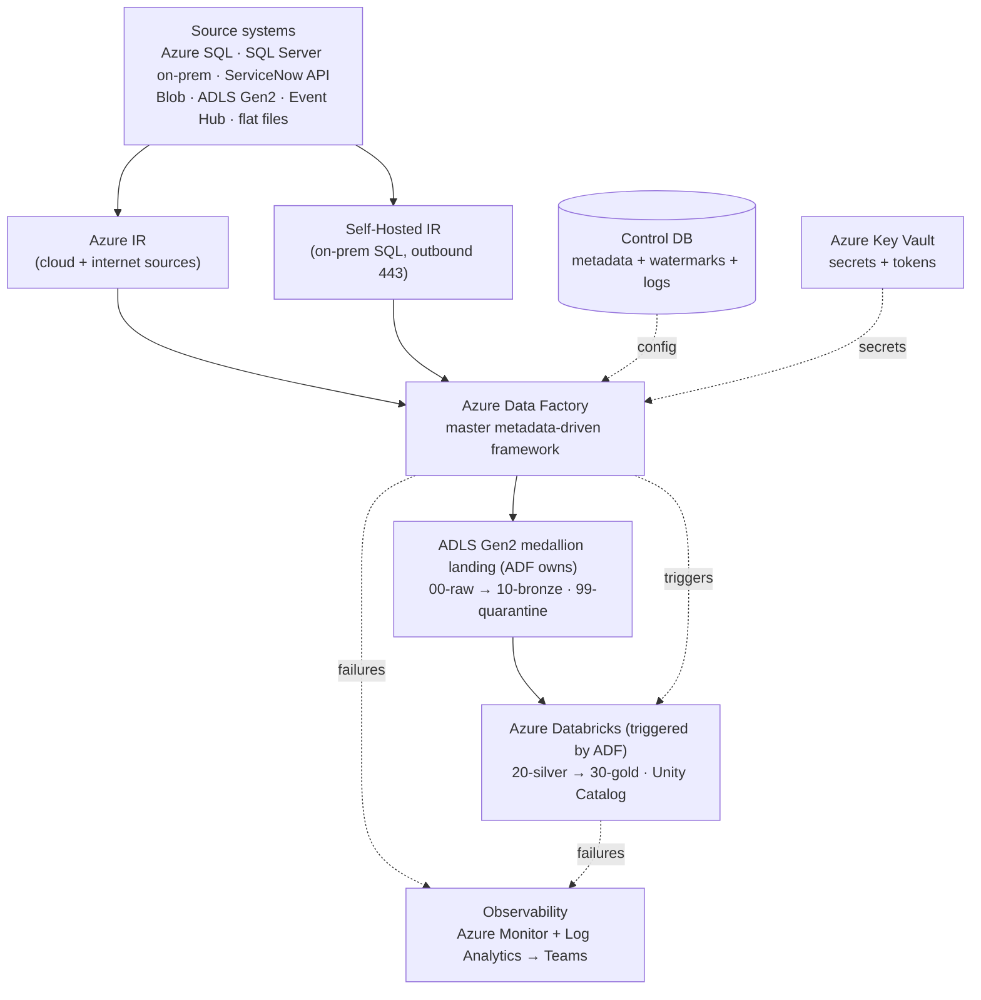

# Enterprise Metadata-Driven Ingestion Framework on Azure Data Factory
### A complete, build-it-yourself project that maps 1:1 to the ADF Engineer JD

> **How to use this guide.** Treat it as a real project sprint plan, not an article. Each section has three layers: **(1) Concept & "why this tech"**, **(2) Hands-on build steps**, and **(3) Interview drill + production war-stories** (troubleshooting, edge cases, tuning, security). Build the artifacts in the order given — every later section assumes the earlier ones exist. By the end you will have physically built every "Must Have" and "Good to Have" line in the skills matrix.
>
> DevOps/CI-CD is intentionally deferred (as you asked). Everywhere a CI/CD decision would normally appear, you'll see a `⏭️ DEVOPS-LATER` marker so you know exactly what to revisit.

---

## Table of Contents

1. [The business scenario (why this project exists)](#1-the-business-scenario)
2. [End-to-end architecture](#2-end-to-end-architecture)
3. [Skills-matrix coverage map](#3-skills-matrix-coverage-map)
4. [Phase 0 — Provision the Azure foundation](#4-phase-0--provision-the-azure-foundation)
5. [Phase 1 — The control / metadata database (T-SQL core)](#5-phase-1--the-control--metadata-database)
6. [Phase 2 — Integration Runtimes (Azure IR + SHIR)](#6-phase-2--integration-runtimes)
7. [Phase 3 — Linked Services, Key Vault & Datasets](#7-phase-3--linked-services-key-vault--datasets)
8. [Phase 4 — The metadata-driven master pipeline framework](#8-phase-4--the-metadata-driven-master-pipeline-framework)
9. [Phase 5 — Source-by-source ingestion patterns](#9-phase-5--source-by-source-ingestion-patterns)
10. [Phase 6 — Incremental load: watermark, CDC, delta detection](#10-phase-6--incremental-load-patterns)
11. [Phase 7 — Medallion landing zone & the ADF→Databricks handoff](#11-phase-7--medallion-landing-zone--the-adfdatabricks-handoff)
12. [Phase 8 — Data quality, quarantine & data contracts](#12-phase-8--data-quality-quarantine--data-contracts)
13. [Phase 9 — Mapping Data Flows](#13-phase-9--mapping-data-flows)
14. [Phase 10 — Triggers (Schedule, Tumbling Window, Event)](#14-phase-10--triggers)
15. [Phase 11 — Databricks integration deep dive (Unity Catalog, DLT, job outcomes)](#15-phase-11--databricks-integration-deep-dive)
16. [Phase 12 — Monitoring, alerting & Teams notifications](#16-phase-12--monitoring-alerting--teams-notifications)
17. [Cross-cutting: Security hardening](#17-cross-cutting-security-hardening)
18. [Cross-cutting: Performance tuning & cost](#18-cross-cutting-performance-tuning--cost)
19. [Troubleshooting & edge-case playbook](#19-troubleshooting--edge-case-playbook)
20. [PySpark survival kit for the ADF engineer](#20-pyspark-survival-kit)
21. [Consolidated interview question bank](#21-consolidated-interview-question-bank)
22. [Final self-assessment checklist](#22-final-self-assessment-checklist)

---

## 1. The business scenario

You are the ADF/ingestion engineer for **Contoso Retail**, a multi-channel retailer (physical stores + e-commerce + partner marketplaces). The lakehouse team has standardised on **Databricks + Unity Catalog + a medallion (Bronze/Silver/Gold) model**. Your job is to own **everything to the left of Bronze**: land every source system cleanly, incrementally, with quality gates, into ADLS Gen2, and hand off to Databricks.

You must ingest **seven heterogeneous sources**, each chosen deliberately to force you to learn a different ADF pattern:

| # | Source | What it represents | ADF skill it forces you to learn |
|---|--------|--------------------|-----------------------------------|
| 1 | **Azure SQL DB** (`SalesOLTP`) | Orders / Customers OLTP replica | Cloud DB copy, watermark incremental |
| 2 | **SQL Server on-prem** (`ERP_Inventory`) | Legacy ERP behind the corporate firewall | Self-Hosted IR, network, CDC |
| 3 | **ServiceNow REST API** | Store IT incidents / CMDB | Paginated REST, OAuth token, Key Vault |
| 4 | **Azure Blob Storage** | Vendor/partner file drops | Blob → ADLS, wildcard/file lists |
| 5 | **ADLS Gen2** (external landing) | Upstream team drops raw JSON | Hierarchical namespace, schema drift |
| 6 | **Azure Event Hub** | POS / clickstream telemetry | Streaming-adjacent capture, Capture feature |
| 7 | **Flat files** (CSV/JSON/Parquet) | Everything else — finance extracts etc. | Format handling, schema drift, quarantine |

**The business rules you must satisfy** (these become your requirements and your interview talking points):

- **No pipeline-per-table sprawl.** A new table/entity must be onboarded by inserting a *metadata row*, not by cloning a pipeline. (This is the master-framework requirement.)
- **Incremental by default.** Full loads are the exception, only for small dimensions or first load.
- **Every bad record is accounted for.** Nothing is silently dropped; invalid rows go to a **quarantine** zone with a failure reason.
- **Idempotent & restartable.** A re-run of a failed batch must not double-load or corrupt watermarks.
- **Auditable.** Every run writes a row to a run-log table: rows read, rows written, rows quarantined, duration, status.
- **Secure by default.** No secrets in ADF. All credentials via **Key Vault** + **Managed Identity**.
- **Observable.** Failures raise an **Azure Monitor alert** and post to a **Teams channel** within minutes.

Keep this scenario in your head — almost every interview answer is stronger when you frame it as "at Contoso we did X because Y."

---

## 2. End-to-end architecture

> A high-resolution, zoomable version of this diagram ships alongside this guide as `contoso_adf_ingestion_architecture.svg` — open it in any browser and zoom freely. The Mermaid below is the same architecture as a top-down flow (renders larger and cleaner than a wide left-to-right layout).

The flow runs top → bottom through five planes: **sources → integration runtimes → ADF (with control DB + Key Vault) → ADLS medallion → Databricks**, with observability underneath.



Colour key for the companion SVG: **gray** = external sources, **blue** = the Azure ingestion/ops plane (IR, ADF, control DB, Key Vault, monitoring), **teal** = the ADLS lake, **coral** = Databricks.

**Reading the flow in words** (this is the "explain the architecture on a whiteboard" answer):

1. A **trigger** (schedule/tumbling/event) starts the **Master Orchestrator** pipeline.
2. The master looks up the **Control DB** to get the list of *enabled entities* to load for this run, plus each entity's config (source type, object name, load type, watermark column, target path…).
3. A **ForEach** iterates entities and calls the correct **child pipeline** by source type. Child pipelines are generic and parameter-driven.
4. Child pipelines read from the source through the correct **Integration Runtime** (Azure IR for cloud/internet sources; **SHIR** for the on-prem SQL Server), authenticating via **Key Vault**.
5. Data lands in **ADLS Gen2 `raw`** as-is, then a light structural pass (or Mapping Data Flow) validates and promotes to **`bronze`**, routing bad rows to **`quarantine`** with a failure reason.
6. On success, ADF calls **Databricks** (via the Databricks linked service), passing parameters (`env`, `catalog`, `batch_id`, watermark values). Databricks does the heavier Silver/Gold transforms and writes to **Unity Catalog** tables.
7. ADF branches on the **Databricks job outcome** for conditional/failure handling, updates watermarks, writes the **run log**, and on any failure raises an **Azure Monitor alert** + **Teams** message.

Keep the boundary crisp in interviews: **ADF owns orchestration + landing + quality gate; Databricks owns transformation.** The medallion "Raw→Bronze" happens under ADF's control; "Silver→Gold" is Databricks. That clean handoff is exactly what the JD's "handing off cleanly to the Databricks medallion stack" means.

---

## 3. Skills-matrix coverage map

Every JD line is built in this project. Use this as your progress tracker.

| Skill (from JD) | Priority | Where you build it |
|---|---|---|
| ADF end-to-end (Copy, Data Flows, Control Flow, error handling) | Must | Phases 4, 5, 9 |
| Master / metadata-driven pipeline design | Must | Phase 4 |
| Mapping Data Flows (transform, split, join) | Must | Phase 9 |
| ADF CI/CD (ARM, DevOps YAML) | Must | ⏭️ DEVOPS-LATER markers throughout |
| Multi-source ingestion (SQL, REST, Blob, EH) | Must | Phase 5 |
| Incremental / watermark / CDC | Must | Phase 6 |
| Azure Key Vault + ADF | Must | Phase 3, §17 |
| ADLS Gen2 + medallion | Must | Phase 7 |
| SQL / T-SQL (procs, CTEs, optimisation) | Must | Phase 1, §18 |
| Databricks job triggering from ADF | Must | Phase 11 |
| Self-Hosted IR (SHIR) | Must | Phase 2 |
| Data contract / DQ enforcement | Good | Phase 8 |
| Databricks DLT / Delta Lake | Good | Phase 11 |
| Unity Catalog | Good | Phase 11 |
| Azure Monitor, Log Analytics, alerting | Good | Phase 12 |
| Python / PySpark basics | Good | Phase 11, §20 |
| Terraform / IaC for ADF | Good | ⏭️ DEVOPS-LATER (§4 note) |

---

## 4. Phase 0 — Provision the Azure foundation

### 4.1 Concept & resource inventory

You need a resource group per environment. For learning, one RG (`rg-contoso-datadev`) is fine; in production you'd have `-dev`, `-uat`, `-prd`. Provision:

| Resource | Purpose | Notes |
|---|---|---|
| Resource Group | Logical container | One per env in prod |
| Azure Data Factory | Orchestration engine | Enable **Managed VNet** if you want data-flow isolation |
| ADLS Gen2 storage acct | The lake | **Enable Hierarchical Namespace (HNS)** — this is what makes it *Gen2*, not plain Blob |
| Azure SQL DB (small) | Control/metadata DB **and** the `SalesOLTP` source | Two logical DBs, or two servers |
| Azure Key Vault | Secrets | Use RBAC access model, not access policies (newer default) |
| Azure Databricks workspace | Transform layer | Premium tier for Unity Catalog |
| Log Analytics workspace | Diagnostics sink | ADF diagnostics route here |
| Event Hub namespace | Streaming source | Standard tier for Capture |
| (Optional) On-prem SQL Server VM | Simulates the firewalled ERP | An Azure VM with SQL Server, no public 1433, forces you to use SHIR realistically |

### 4.2 Hands-on

1. Create the RG.
2. Create the storage account → **enable Hierarchical Namespace** at creation (cannot be changed later — common gotcha). Create a container `lake`.
3. Create ADF. In **Manage → Git configuration**, connect to a repo. `⏭️ DEVOPS-LATER`: this is where ARM export / branch strategy lives; for now you can work in *Live mode* but connecting Git early is the production habit.
4. Create Key Vault with **RBAC authorization**. Grant your ADF's **system-assigned managed identity** the role **Key Vault Secrets User**.
5. Turn on ADF's system-assigned managed identity (Manage → Managed identities). You'll reference this identity everywhere instead of passwords.

> **⏭️ DEVOPS-LATER / Terraform note.** In a real shop none of the above is click-ops — it's Terraform or Bicep modules. The JD lists "Terraform / IaC for ADF provisioning — Basic". When you revisit DevOps, re-create this exact resource set as a Terraform module (`azurerm_data_factory`, `azurerm_storage_account` with `is_hns_enabled = true`, `azurerm_key_vault`, role assignments). For now, click-ops is fine to *learn the objects*; just know that "how would you provision this repeatably?" → "IaC, parameterised per env."

### 4.3 Interview drill

- **Q: What makes ADLS Gen2 different from Blob Storage?** The **hierarchical namespace** — real directories with atomic folder operations and POSIX-like ACLs, plus better analytics performance and the `abfss://` driver. Blob is flat (folders are just name prefixes). Gen2 is Blob *with* HNS turned on; you cannot toggle HNS on an existing account.
- **Q: System-assigned vs user-assigned managed identity?** System-assigned is tied 1:1 to the ADF and dies with it; simplest. User-assigned is a standalone identity you can share across multiple ADFs/resources — better when many services need the *same* permissions or when you deploy identical identities across envs via IaC.
- **Q: Why RBAC access model on Key Vault over access policies?** Central, auditable, Azure-AD-native permissioning; works with PIM and role assignments; Microsoft's recommended default. Access policies are the legacy model with coarser control.

---

## 5. Phase 1 — The control / metadata database

This is the **brain** of the framework and the single most important thing to get right. It's also where you demonstrate the "Advanced T-SQL — stored procs, CTEs, optimisation" skill. Everything the master pipeline does is driven by rows in these tables.

### 5.1 Concept — why metadata-driven

Without metadata: 1 pipeline per table → 300 tables → 300 pipelines → unmaintainable, untestable, every change is a deployment.

With metadata: **one generic pipeline** reads config rows and behaves differently per row. Onboarding a new table = one `INSERT`. This is the difference between a junior "ADF developer" and a senior "framework designer" — the JD explicitly wants the latter ("Architect a master pipeline framework — modular, metadata-driven, parameterised").

### 5.2 The schema (DDL)

Create a database `ControlDB`. Use a dedicated schema `ctl`.

```sql
CREATE SCHEMA ctl;
GO

-- 1. Source systems (connection-level metadata, NOT secrets)
CREATE TABLE ctl.SourceSystem (
    SourceSystemId   INT IDENTITY PRIMARY KEY,
    SourceSystemName VARCHAR(100) NOT NULL UNIQUE,   -- 'SalesOLTP','ERP_Inventory','ServiceNow'...
    SourceType       VARCHAR(30)  NOT NULL,           -- 'AzureSql','SqlServerOnPrem','RestApi','Blob','ADLS','EventHub','FlatFile'
    LinkedServiceName VARCHAR(100) NOT NULL,          -- the ADF linked service to use
    IntegrationRuntime VARCHAR(60) NOT NULL,          -- 'AutoResolveIR' or 'shir-contoso'
    IsEnabled        BIT NOT NULL DEFAULT 1,
    CreatedUtc       DATETIME2 DEFAULT SYSUTCDATETIME()
);

-- 2. Entity config (one row = one table/object to ingest)
CREATE TABLE ctl.EntityConfig (
    EntityId         INT IDENTITY PRIMARY KEY,
    SourceSystemId   INT NOT NULL REFERENCES ctl.SourceSystem(SourceSystemId),
    SourceObject     VARCHAR(200) NOT NULL,           -- schema.table, API resource, file glob
    TargetContainer  VARCHAR(60)  NOT NULL DEFAULT 'lake',
    TargetPath       VARCHAR(400) NOT NULL,           -- e.g. '10-bronze/salesoltp/orders'
    LoadType         VARCHAR(20)  NOT NULL,           -- 'FULL' | 'INCREMENTAL' | 'CDC'
    WatermarkColumn  VARCHAR(128) NULL,               -- e.g. 'ModifiedDate' (NULL for FULL)
    WatermarkType    VARCHAR(20)  NULL,               -- 'datetime' | 'bigint'(rowversion) | 'lsn'
    PrimaryKeyCols   VARCHAR(400) NULL,               -- for merge/dedup, comma-separated
    FileFormat       VARCHAR(20)  NULL,               -- 'csv'|'json'|'parquet' for file sources
    SchemaContract   NVARCHAR(MAX) NULL,              -- JSON expected schema (data contract)
    QualityRules     NVARCHAR(MAX) NULL,              -- JSON DQ rules
    LoadPriority     INT NOT NULL DEFAULT 100,        -- ordering / parallel grouping
    IsEnabled        BIT NOT NULL DEFAULT 1,
    CONSTRAINT UQ_Entity UNIQUE (SourceSystemId, SourceObject)
);

-- 3. Watermark store (current high-water mark per entity)
CREATE TABLE ctl.Watermark (
    EntityId        INT PRIMARY KEY REFERENCES ctl.EntityConfig(EntityId),
    WatermarkValue  VARCHAR(50) NOT NULL,             -- stored as string; cast per WatermarkType
    LastLoadUtc     DATETIME2 NULL
);

-- 4. Run log (one row per entity per batch run) - the audit trail
CREATE TABLE ctl.PipelineRunLog (
    RunLogId        BIGINT IDENTITY PRIMARY KEY,
    BatchId         UNIQUEIDENTIFIER NOT NULL,        -- groups all entities in one master run
    EntityId        INT NOT NULL REFERENCES ctl.EntityConfig(EntityId),
    PipelineName    VARCHAR(200) NOT NULL,
    AdfRunId        VARCHAR(100) NULL,                -- ADF's own pipeline run GUID
    Status          VARCHAR(20)  NOT NULL,            -- 'Running'|'Succeeded'|'Failed'|'Quarantined'
    RowsRead        BIGINT NULL,
    RowsWritten     BIGINT NULL,
    RowsQuarantined BIGINT NULL,
    OldWatermark    VARCHAR(50) NULL,
    NewWatermark    VARCHAR(50) NULL,
    ErrorMessage    NVARCHAR(MAX) NULL,
    StartUtc        DATETIME2 NOT NULL DEFAULT SYSUTCDATETIME(),
    EndUtc          DATETIME2 NULL
);
CREATE INDEX IX_RunLog_Batch ON ctl.PipelineRunLog(BatchId, EntityId);
```

Design points to be able to defend:

- **Watermark stored as `VARCHAR`** with a separate `WatermarkType`: lets one column hold datetimes, `rowversion` bigints, or LSNs. You cast at read time. Alternative: typed columns per type — cleaner typing but the generic pipeline gets messier. Trade-off worth stating.
- **`SchemaContract` / `QualityRules` as JSON**: keeps DQ config data-driven so a business analyst can change a rule without redeploying pipelines.
- **`BatchId`** groups a whole master run so you can answer "did last night's 02:00 batch fully succeed?" in one query.

### 5.3 Stored procedures (the T-SQL you'll be quizzed on)

**Get the entities to run** (feeds the master pipeline's `Lookup`):

```sql
CREATE OR ALTER PROCEDURE ctl.usp_GetEntitiesToLoad
    @SourceType VARCHAR(30) = NULL   -- optional filter
AS
BEGIN
    SET NOCOUNT ON;
    SELECT  e.EntityId, s.SourceSystemName, s.SourceType, s.LinkedServiceName,
            s.IntegrationRuntime, e.SourceObject, e.TargetContainer, e.TargetPath,
            e.LoadType, e.WatermarkColumn, e.WatermarkType, e.PrimaryKeyCols,
            e.FileFormat, e.SchemaContract, e.QualityRules,
            ISNULL(w.WatermarkValue, '1900-01-01') AS CurrentWatermark
    FROM    ctl.EntityConfig  e
    JOIN    ctl.SourceSystem  s ON s.SourceSystemId = e.SourceSystemId
    LEFT JOIN ctl.Watermark   w ON w.EntityId = e.EntityId
    WHERE   e.IsEnabled = 1 AND s.IsEnabled = 1
      AND  (@SourceType IS NULL OR s.SourceType = @SourceType)
    ORDER BY e.LoadPriority, e.EntityId;
END;
```

**Start a run-log row** (called at the top of each child pipeline):

```sql
CREATE OR ALTER PROCEDURE ctl.usp_StartRunLog
    @BatchId UNIQUEIDENTIFIER, @EntityId INT,
    @PipelineName VARCHAR(200), @AdfRunId VARCHAR(100), @OldWatermark VARCHAR(50)
AS
BEGIN
    INSERT ctl.PipelineRunLog (BatchId, EntityId, PipelineName, AdfRunId, Status, OldWatermark)
    VALUES (@BatchId, @EntityId, @PipelineName, @AdfRunId, 'Running', @OldWatermark);
    SELECT SCOPE_IDENTITY() AS RunLogId;   -- returned to ADF for the closing update
END;
```

**Close a run-log row + advance watermark atomically** (the idempotency-critical proc):

```sql
CREATE OR ALTER PROCEDURE ctl.usp_CompleteRunLog
    @RunLogId BIGINT, @EntityId INT, @Status VARCHAR(20),
    @RowsRead BIGINT, @RowsWritten BIGINT, @RowsQuarantined BIGINT,
    @NewWatermark VARCHAR(50) = NULL, @ErrorMessage NVARCHAR(MAX) = NULL
AS
BEGIN
    SET XACT_ABORT ON;
    BEGIN TRAN;
        UPDATE ctl.PipelineRunLog
        SET Status=@Status, RowsRead=@RowsRead, RowsWritten=@RowsWritten,
            RowsQuarantined=@RowsQuarantined, NewWatermark=@NewWatermark,
            ErrorMessage=@ErrorMessage, EndUtc=SYSUTCDATETIME()
        WHERE RunLogId=@RunLogId;

        -- Advance watermark ONLY on success. This is what makes re-runs safe.
        IF @Status = 'Succeeded' AND @NewWatermark IS NOT NULL
        BEGIN
            MERGE ctl.Watermark AS tgt
            USING (SELECT @EntityId AS EntityId, @NewWatermark AS wm) AS src
            ON tgt.EntityId = src.EntityId
            WHEN MATCHED THEN UPDATE SET WatermarkValue=src.wm, LastLoadUtc=SYSUTCDATETIME()
            WHEN NOT MATCHED THEN INSERT (EntityId, WatermarkValue, LastLoadUtc)
                                  VALUES (src.EntityId, src.wm, SYSUTCDATETIME());
        END
    COMMIT;
END;
```

**A CTE example they may ask you to write on the spot** — "show the latest run status per entity for a given batch":

```sql
WITH ranked AS (
    SELECT *, ROW_NUMBER() OVER (PARTITION BY EntityId ORDER BY RunLogId DESC) AS rn
    FROM   ctl.PipelineRunLog
    WHERE  BatchId = @BatchId
)
SELECT e.SourceObject, r.Status, r.RowsWritten, r.RowsQuarantined,
       DATEDIFF(SECOND, r.StartUtc, r.EndUtc) AS DurationSec
FROM   ranked r JOIN ctl.EntityConfig e ON e.EntityId = r.EntityId
WHERE  r.rn = 1
ORDER  BY r.Status DESC;
```

### 5.4 Best practices baked in here

- **Watermark advances only on `Succeeded`.** If a load fails mid-way, the watermark is untouched, so the next run re-pulls the same window → **no data loss**, and because the sink write is idempotent (overwrite-partition or merge on PK) → **no duplication**.
- **Never `SELECT *` in production procs** — name columns so schema drift on the control DB doesn't silently break the pipeline.
- **Parameterise, don't concatenate** where SQL Injection is possible (dynamic source queries built in ADF should use ADF's parameterised query where the driver supports it, or heavily validated metadata).

### 5.5 Interview drill

- **Q: Why store the watermark in a control table instead of computing `MAX()` from the target each time?** Target may be in the lake/Databricks (expensive to scan), the control table is the single source of truth, and it decouples ADF from the target's availability. Also lets you *manually rewind* a watermark to reprocess.
- **Q: How do you make the framework idempotent?** Watermark advances only on success + idempotent sink (partition overwrite or PK merge) + `BatchId` so re-runs are traceable. A failed batch re-run re-pulls the same delta and overwrites the same partition.
- **Q: CTE vs subquery vs temp table vs table variable?** CTE = readability/recursion, no materialisation guarantee, scoped to one statement. Temp table (`#t`) = materialised, indexable, has stats — best for large intermediate sets reused multiple times. Table variable = no stats (cardinality est. of 1 pre-2019), fine for tiny sets. Subquery = inline, optimiser may unnest.
- **Q: How would you index the control DB?** PK on `EntityId`; the `IX_RunLog_Batch` covering index for the "batch status" query; keep control tables small so scans are cheap anyway.

---

## 6. Phase 2 — Integration Runtimes

### 6.1 Concept — the three IR types

The **Integration Runtime (IR)** is the compute that actually moves/transforms data. Three flavours:

| IR type | Runs where | Use it for |
|---|---|---|
| **Azure IR (AutoResolve)** | Microsoft-managed, in Azure | Cloud-to-cloud copy, any internet-reachable source (REST, Blob, Azure SQL), and **Mapping Data Flows** (spins up a Spark cluster) |
| **Self-Hosted IR (SHIR)** | A machine *you* install it on (on-prem/VNet VM) | Reaching private/on-prem data that the cloud can't route to (the ERP SQL Server) |
| **Azure-SSIS IR** | Managed cluster to lift-and-shift SSIS packages | Legacy SSIS migration (not in this JD, know it exists) |

### 6.2 Why SHIR is mandatory here

Contoso's `ERP_Inventory` SQL Server sits inside the corporate network with **no public endpoint**. Azure IR literally cannot reach it. SHIR is an agent you install on a Windows box *inside* that network; it makes an **outbound HTTPS** connection to ADF and relays data — so you never open inbound firewall ports. That's the whole security selling point.

### 6.3 Hands-on: install & register SHIR

1. In ADF → **Manage → Integration runtimes → New → Self-Hosted**. Name it `shir-contoso`. Copy **Key1**.
2. On the on-prem/VM Windows host: download the IR MSI, install, paste Key1 to register. Node shows **Running**.
3. **High availability**: register a **second node** (same key) on another host. SHIR supports up to 4 nodes for HA + throughput. This is a favourite interview point — "how do you make SHIR resilient?"
4. Ensure the host can resolve/reach the SQL Server on 1433 and has the right driver.

### 6.4 Best practices / production reality

- **Dedicated host, not a shared app server.** SHIR is CPU/memory hungry during copies.
- **Auto-update**: leave it on but pin a maintenance window; a bad auto-update once broke a node → keep ≥2 nodes so one can drain.
- **Scale-up vs scale-out**: scale *up* (bigger box, more concurrent jobs per node via `Concurrent Jobs` setting) for CPU-bound; scale *out* (more nodes) for throughput/HA.
- **Don't share one SHIR across unrelated projects** if isolation/security boundaries matter; but *do* share within a project to reduce ops overhead. State the trade-off.
- **Self-contained interactive authoring** must be enabled to test connections from the portal.

### 6.5 Interview drill

- **Q: Inbound firewall ports for SHIR?** None inbound. SHIR dials **outbound 443** to Azure Relay/ADF. That's why security teams accept it.
- **Q: SHIR down at 2 AM — what happens & how do you know?** Jobs routed to it queue then fail on timeout; you catch it via the SHIR **node status** in Azure Monitor / an alert on IR availability, plus the pipeline failure alert. HA (2nd node) prevents the outage.
- **Q: Can one SHIR serve multiple data factories?** Yes — **shared/linked SHIR**: register it once, share it to other factories. Good for a hub-and-spoke of factories.
- **Q: Where do Mapping Data Flows run?** On an **Azure IR** (managed Spark), *never* SHIR. So if your DF needs on-prem data, you must first *copy* it to the lake via SHIR, then run the DF on Azure IR.

### 6.6 ⏭️ DEVOPS-LATER
SHIR install is not in CI/CD, but its **name** must be identical across env-specific ARM parameter files so the same pipeline JSON resolves in each environment. Note it for when you do the ARM/YAML work.

---

## 7. Phase 3 — Linked Services, Key Vault & Datasets

### 7.1 The object model (must be crisp for interviews)

- **Linked Service** = a *connection string* to a system ("where + how to connect"). Points at an IR + credentials.
- **Dataset** = a *named view of data within* a linked service ("which table/file/API resource + its shape").
- **Activity** (in a pipeline) = the *action* using datasets ("copy this dataset to that dataset").

Analogy for the whiteboard: Linked Service = the database server login; Dataset = a specific table; Activity = the query you run.

### 7.2 Key Vault–backed linked services (the security "Must Have")

**Never** type a password into a linked service. Instead:

1. Create a **Key Vault linked service** in ADF (auth = **Managed Identity**, which you already granted *Key Vault Secrets User*).
2. Store each source secret in KV: e.g. secret `sql-erp-password`, `servicenow-client-secret`, `servicenow-token`.
3. In each source linked service, choose **"Azure Key Vault"** for the password/secret field and reference the secret name.

Result: rotating a password = update the KV secret; **zero ADF redeployment**. Secrets never appear in ARM templates (only the *reference* does) — this is why KV is non-negotiable for CI/CD later.

**Even better**: for Azure SQL and ADLS, skip passwords entirely — use **Managed Identity auth** (grant ADF's MI the `db_datareader` role in Azure SQL, or `Storage Blob Data Contributor` on ADLS). No secret at all is the strongest posture. Use KV only where the source can't do AAD/MI (on-prem SQL, ServiceNow).

### 7.3 Datasets: keep them generic

For a metadata-driven framework, do **not** create 300 datasets. Create a handful of **parameterised** datasets:

- One **Azure SQL dataset** with parameters `@schema`, `@table` (or a `@query`).
- One **DelimitedText/JSON/Parquet dataset** with parameters `@container`, `@folderPath`, `@fileName`.
- One **REST dataset** with a `@relativeUrl` parameter.

The child pipeline passes values into these parameters at runtime. This is *the* mechanism that lets one pipeline serve many entities.

### 7.4 Best practices

- **Naming convention** (JD explicitly wants this): `LS_<System>_<Type>` for linked services (`LS_ERP_SqlServer`), `DS_<System>_<Format>_Generic` for datasets, `PL_<Master|Child>_<Purpose>` for pipelines. Consistency makes PR review and ARM diffs sane.
- **One linked service per source system**, parameterised — not per table.
- **Test connection** for every linked service before wiring pipelines.

### 7.5 Interview drill

- **Q: Difference between linked service and dataset?** Connection vs. data shape (see 7.1). A dataset always sits *on top of* a linked service.
- **Q: How do you avoid secrets in source control?** KV-backed linked services + Managed Identity; ARM stores only the secret *reference* URI, never the value. `⏭️ DEVOPS-LATER`: env-specific KV per environment, resolved via ARM parameters.
- **Q: How does ADF authenticate to Key Vault?** ADF's managed identity holds the *Key Vault Secrets User* RBAC role; no secret-to-get-secrets bootstrap problem.
- **Q: Parameterised dataset vs one-per-table — trade-off?** Parameterised = DRY, scales, but slightly harder to eyeball in the UI and you lose per-dataset schema import. For a framework, DRY wins; for a handful of bespoke feeds, explicit datasets are clearer.

---

## 8. Phase 4 — The metadata-driven master pipeline framework

This is the heart of the JD ("Architect a master pipeline framework — modular, metadata-driven, parameterised — supporting multi-entity and multi-source ingestion without code duplication"). Build it once; everything else plugs in.

### 8.1 The pipeline hierarchy

```
PL_Master_Orchestrator
   ├─ Lookup:  usp_GetEntitiesToLoad   → array of entity configs
   ├─ Set Variable: BatchId = @guid()
   └─ ForEach (over entities, batchCount = N)
         └─ Switch (on item().SourceType)
               ├─ 'AzureSql' / 'SqlServerOnPrem' → Execute Pipeline: PL_Child_SqlIngest
               ├─ 'RestApi'                       → Execute Pipeline: PL_Child_RestIngest
               ├─ 'Blob' / 'ADLS' / 'FlatFile'    → Execute Pipeline: PL_Child_FileIngest
               └─ 'EventHub'                       → Execute Pipeline: PL_Child_EventHubIngest
```

Each child pipeline is **generic and parameterised** — it receives the whole entity config object and figures out what to do from it. Adding a new table never touches a pipeline; you insert a `ctl.EntityConfig` row.

### 8.2 Master orchestrator — activity by activity

1. **Lookup `Lookup_GetEntities`**: runs `ctl.usp_GetEntitiesToLoad`. Set **First row only = OFF** so you get the full array in `@activity('Lookup_GetEntities').output.value`.
2. **Set Variable `BatchId`**: `@guid()` — one batch id for the whole run.
3. **ForEach `FE_Entities`**:
   - Items: `@activity('Lookup_GetEntities').output.value`
   - **Sequential** vs **parallel**: uncheck *Sequential* and set **Batch count** (e.g. 8) to control parallelism. Interview gold — see 8.5.
   - Inside, a **Switch** on `@item().SourceType` routes to the right child via **Execute Pipeline** activities, passing parameters like `@item().SourceObject`, `@item().TargetPath`, `@item().LoadType`, `@item().CurrentWatermark`, `@variables('BatchId')`, `@item().EntityId`.

### 8.3 Control Flow activities the JD names — where each appears

| Activity | Where you use it in this project |
|---|---|
| **ForEach** | Iterate entities in the master |
| **If Condition** | In file child: `IF fileCount == 0` → skip vs. proceed; in REST child: `IF hasMorePages` |
| **Switch** | Route by `SourceType` (cleaner than nested Ifs) |
| **Until** | REST pagination loop — keep calling until `next` cursor is empty |
| **Execute Pipeline** | Master → child |
| **Lookup** | Read config & watermark |
| **Set/Append Variable** | Build the paginated result set, hold BatchId |
| **Stored Procedure** | Start/close run-log, advance watermark |
| **Fail** | Deliberately fail the pipeline with a custom message when a DQ contract is violated ("fail fast") |
| **Wait / Validation / Get Metadata** | Throttle REST; check a file landed before processing |

### 8.4 Error handling pattern (do this in every child pipeline)

ADF activities have four dependency outputs: **Success (green), Failure (red), Completion (blue), Skipped (grey).** Robust pattern:

1. First activity: **`SP_StartRunLog`** (status `Running`), capture `RunLogId`.
2. Do the copy/transform.
3. **On the copy's *Success*** → `SP_CompleteRunLog` with `Succeeded` + new watermark.
4. **On the copy's *Failure*** → `SP_CompleteRunLog` with `Failed` + `@activity('Copy').error.message`, then a **Fail** activity (or let the child fail) so the error bubbles to the master.
5. Wrap risky sections and use **`Completion` + If** to distinguish "failed but handled" from "hard fail".

> Because each entity runs in its **own child pipeline instance**, one entity failing does **not** kill the others by default — the ForEach continues, and you get a per-entity status in the run log. Set the ForEach/child **`Fault tolerance`** intentionally: usually you want the batch to *continue* other entities and report a partial success, then alert. That's the enterprise expectation ("don't let one bad table stop the nightly load").

### 8.5 Best practices & the parallelism trade-off

- **Batch count (parallelism)**: higher = faster but hammers sources and the SHIR/DB. Typical 4–20. Tune per source: an on-prem SQL Server via SHIR might only take 4 concurrent; cloud Blob can take 20.
- **Idempotent children**: each child must be safe to re-run (watermark-gated + partition overwrite).
- **Parameter contracts**: define the child's parameters once and pass the *entity config object* whole where possible (pass the JSON, `@string(item())`, and parse inside) — reduces parameter sprawl. Alternative: explicit typed params (clearer, more verbose). Mention both.
- **Fail fast vs. continue**: DQ contract breach → `Fail` (block bad data). Transient copy error → retry then continue-and-alert. Know *which* failures should stop the world.
- **Retry & timeout** on Copy activities: retries=2–3, interval 30–60s, sensible timeout so a hung source doesn't pin the batch for 7 days (the default).

### 8.6 Common edge cases handled here

- **Empty source (0 rows in the delta)**: don't fail — write a `Succeeded` log with `RowsWritten=0` and **still advance the watermark**? No — advance only if you actually moved the window; for pure delta with no rows, advance watermark to the query's upper bound (see Phase 6) so you don't re-scan forever.
- **Duplicate trigger fire** (two masters at once): guard with a "is a batch already running?" check against the run log, or rely on trigger concurrency = 1.
- **One entity's config is malformed** (null watermark col but LoadType=INCREMENTAL): validate in the child and route to a config-error path rather than crashing.

### 8.7 Interview drill

- **Q: How do you add a new source table with zero code change?** `INSERT` one `ctl.EntityConfig` row (and a `ctl.SourceSystem` row if it's a new system). Next run picks it up via the Lookup. That sentence *is* the interview win.
- **Q: ForEach sequential vs parallel — when sequential?** Sequential when order matters (dimension before fact) or the source can't take concurrency; parallel (batch count) for throughput. You can also split into priority groups.
- **Q: How does one entity's failure not kill the batch?** Isolated child pipeline per entity + ForEach continues + per-entity run-log status + alert on any `Failed`. Contrast with putting everything in one pipeline where the first failure aborts.
- **Q: Switch vs nested If?** Switch is cleaner for >2 mutually exclusive branches on one value (SourceType); If for boolean gates.
- **Q: Execute Pipeline "Wait on completion" — on or off?** On, so the master knows child outcome for logging/branching. Off = fire-and-forget (rare; loses outcome).
- **Q: Pipeline vs data flow parameters vs global parameters?** Pipeline params = per-run inputs; variables = mutable within a run; global params = factory-wide constants (env name, base paths) resolved per environment via ARM — great for `⏭️ DEVOPS-LATER`.

---

## 9. Phase 5 — Source-by-source ingestion patterns

Each source teaches a distinct pattern. Build them as the child pipelines from Phase 4.

### 9.1 Azure SQL DB (`SalesOLTP`) — the baseline

- **Linked service**: Azure SQL, auth = **Managed Identity** (grant ADF's MI `db_datareader`). No secret.
- **Copy activity**: source = query, sink = Parquet in `raw/salesoltp/orders`.
- **Incremental query** built from metadata (watermark from control DB — see Phase 6):
  ```sql
  SELECT * FROM Sales.Orders
  WHERE ModifiedDate > '@{pipeline().parameters.CurrentWatermark}'
    AND ModifiedDate <= '@{variables('RunUpperBound')}';
  ```
- **Why an upper bound?** Freeze the window at run start so rows written *during* the copy aren't half-captured; the next run picks them up. Prevents the "moving target" gap.
- **Write to Parquet, not CSV**, in the lake — columnar, compressed, typed, splittable. CSV only when a downstream demands it.

### 9.2 SQL Server on-prem (`ERP_Inventory`) via SHIR

- **Linked service**: SQL Server, IR = `shir-contoso`, password from **Key Vault**.
- Same copy pattern as 9.1 but routed through SHIR.
- **Performance lever**: enable **source partitioning** on the Copy activity (partition by a numeric/date column) so the copy parallelises reads — critical for big ERP tables over SHIR.
- **CDC option**: if the ERP has SQL Server **CDC** or **Change Tracking** enabled, prefer it over watermarking (Phase 6).
- **Edge case**: SHIR box timezone ≠ UTC → watermark comparisons drift. Always compute windows in **UTC** and store watermarks in UTC.

### 9.3 ServiceNow REST API — the hardest pattern (pagination + OAuth + KV)

This single source proves "Handle paginated REST APIs with OAuth/token authentication managed via Azure Key Vault."

**Auth flow (OAuth 2.0 client-credentials):**
1. Store `client_id`, `client_secret` in **Key Vault**.
2. **Web activity** POSTs to the token endpoint to get a bearer token. Pull the client secret via a preceding **Web activity to Key Vault's secret URL** (ADF MI authenticates) — the token *never* lands in a dataset or log.
3. Mark the token Web activity's output as **secure output** so it isn't logged.

**Pagination pattern (`Until` loop):**
```
Set Variable: relativeUrl = '/api/now/table/incident?sysparm_limit=1000&sysparm_offset=0'
Set Variable: keepGoing = true
Until (@equals(variables('keepGoing'), false)):
   ├─ Copy/Web: GET @variables('relativeUrl') with Authorization: Bearer <token>
   ├─ Append the page's records to the raw sink (append or numbered file per page)
   ├─ If Condition: @less(returnedCount, 1000)  → Set keepGoing=false
   │                                           else → advance offset, rebuild relativeUrl
```
- ServiceNow uses **offset/limit** (`sysparm_offset`). Other APIs use a **cursor/next-link** — same `Until` loop, you just read `@activity('Get').output.nextLink` instead of incrementing an offset.
- **REST connector pagination rules** can auto-follow `nextLink` for the Copy activity; use `Until` when the API is non-standard (ServiceNow-style offset) or needs token refresh mid-loop.

**Token expiry edge case**: long pulls can outlive a token. Re-request the token every N pages or on a 401 (catch via `If` on status code).

**Throttling / 429**: honour `Retry-After`; add a **Wait** activity; set Copy retries. Interviewers love "how do you handle 429?".

### 9.4 Azure Blob & ADLS Gen2 file drops

- **Wildcards / file lists**: Copy source supports `*.csv` wildcards and **"list of files"** for known sets. `Get Metadata` + `ForEach(childItems)` when you must act per-file (e.g. archive each after processing).
- **Move-after-copy**: ADF Copy has a **"Delete files after completion"** / you implement archive by copying to `archive/` then a Delete activity — build a "process-once" pattern so re-runs don't reprocess.
- **ADLS Gen2 ACLs vs Blob**: Gen2 has POSIX ACLs; grant ADF MI `Storage Blob Data Contributor` at container scope.

### 9.5 Azure Event Hub (POS telemetry)

ADF is **batch**, not a streaming engine. Two realistic patterns:

1. **Event Hubs Capture (recommended for ADF-centric ingestion)**: turn on Capture → Event Hub auto-writes Avro batches to ADLS on a time/size window. ADF then treats those as *files* (pattern 9.4). This is the clean, cheap way to "ingest from Event Hub" with ADF.
2. **Databricks Structured Streaming** reads Event Hub directly for true low-latency; ADF just orchestrates the Databricks job. Use when latency matters.

**Interview framing**: "ADF ingests Event Hub *via Capture-to-ADLS*, because ADF is a batch orchestrator; for real streaming I'd hand off to Databricks Structured Streaming and orchestrate it from ADF." That answer shows you know the boundary.

### 9.6 Flat files (CSV / JSON / Parquet) + schema drift

- **Format datasets**: `DelimitedText` (CSV/TSV — set delimiter, quote, escape, header, encoding), `Json`, `Parquet`.
- **Schema drift** (JD: "Manage schema drift and format variations"): in the **Copy** activity keep mapping **dynamic/auto** (no explicit column mapping) so new/removed columns pass through; enforce the *contract* later in a Mapping Data Flow with **"Allow schema drift"** + `byName()`/`byPosition()` rules. For hard validation, compare incoming schema to `ctl.EntityConfig.SchemaContract` and quarantine on mismatch.
- **Format variations edge cases**: mixed encodings (UTF-8 vs UTF-16 BOM), embedded newlines in quoted CSV fields (set quote/escape correctly), inconsistent date formats (parse in Silver, not Bronze), ragged rows (extra/missing columns → quarantine).

### 9.7 Best practices across all sources

- **Land raw as-is first** (schema-on-read), then validate — so you can always replay from raw without re-hitting the source.
- **Partition the lake by load date**: `.../orders/ingest_date=2026-07-17/` — enables partition overwrite and cheap time-travel.
- **Compress** (Parquet+Snappy) to cut storage and downstream scan cost.
- **One connector, many entities** via parameterisation — never a linked service per table.

### 9.8 Interview drill

- **Q: How do you ingest a paginated OAuth API and keep the token secret?** KV-stored client secret → Web activity gets bearer token (secure output) → `Until` loop over offset/next-link → honour 429 with Wait/retry → refresh token on 401/expiry.
- **Q: Copy activity: how to speed up a huge on-prem table?** Source partitioning (dynamic range on an indexed numeric/date col), parallel copies, staged copy via blob, right DIU/parallelism, and index the watermark column on the source.
- **Q: Can ADF do real-time streaming from Event Hub?** Not natively — use **Event Hubs Capture → ADLS → ADF batch**, or orchestrate **Databricks Structured Streaming**. ADF is a batch orchestrator.
- **Q: How do you make file ingestion process-once?** Get Metadata → process → archive/delete; or watermark on file `lastModified`; or an event trigger per new blob.
- **Q: Schema drift — what does "Allow schema drift" actually do?** Lets columns not defined at design time flow through the data flow using late-binding (`byName`), instead of failing on unknown columns.

---

## 10. Phase 6 — Incremental load patterns

The JD wants three techniques: **watermark, CDC, and delta detection**. Know when to use each.

### 10.1 Watermark (high-water mark) — the default

**Idea**: track the max value of a monotonically increasing column (`ModifiedDate` or `rowversion`). Each run pulls rows `> lastWatermark AND <= upperBound`.

**Pipeline steps (per entity):**
1. `Lookup` old watermark from `ctl.Watermark` (already supplied by the master).
2. Compute the **upper bound**: for datetime, `@utcNow()`; for `rowversion`, `SELECT MIN_ACTIVE_ROWVERSION()`; freeze it at run start.
3. Copy `WHERE wm_col > @old AND wm_col <= @upper`.
4. On success, `usp_CompleteRunLog` sets `NewWatermark = @upper`.

**Why `rowversion` beats `ModifiedDate` when available**: `rowversion` is DB-guaranteed monotonic and immune to clock skew, timezones, and app code that forgets to set `ModifiedDate`. `ModifiedDate` breaks if a bulk update doesn't touch it.

**Pros**: simple, no source feature required, works on almost anything.
**Cons**: **misses hard deletes** (row gone → nothing to detect); needs a reliable increasing column and an index on it.

### 10.2 CDC (Change Data Capture)

**Idea**: the *source* records inserts/updates/**deletes** in change tables; you read the change stream.

Flavours you should name:
- **SQL Server CDC** — capture instances + `cdc.fn_cdc_get_all_changes_*`; gives operation type (I/U/D) and before/after. Reads via LSN watermark.
- **SQL Server Change Tracking (CT)** — lighter; tells you *which rows changed* (and I/U/D) but not intermediate values; uses a version number.
- **ADF native "Change Data Capture" resource** and **Mapping Data Flow "Enable CDC"** — ADF-managed incremental with less plumbing (newer feature).
- **Databricks/Delta CDF** (`readChangeFeed`) — change feed on the Silver/Gold side.

**Pros**: captures **deletes**, exact change semantics, low source load once set up.
**Cons**: requires enabling CDC on the source (DBA buy-in), LSN/cleanup management, more moving parts. On-prem `ERP_Inventory` is the ideal CDC candidate.

### 10.3 Delta detection (hash / full-compare)

**Idea**: no reliable watermark and no CDC → pull the full (or keyed) set and compute a **row hash** (`HASHBYTES('SHA2_256', concat_cols)`), compare against last snapshot to find inserts/updates/deletes.

**Where**: usually done in a Mapping Data Flow or Databricks (join current vs previous on PK, compare hash).

**Pros**: works on *any* source, detects deletes.
**Cons**: expensive (moves/reads everything), only viable for small-to-medium dimensions.

### 10.4 Decision table (memorise this)

| Situation | Use |
|---|---|
| Reliable `rowversion`/`ModifiedDate`, deletes rare/soft | **Watermark** |
| Deletes matter + can enable source CDC | **CDC / Change Tracking** |
| No watermark, no CDC, table is smallish | **Delta detection (hash)** |
| Small static dimension | **Full load** (simplest) |

### 10.5 Handling deletes with watermarking (common follow-up)

Since watermarks miss hard deletes, enterprises either: (a) switch that entity to **soft deletes** (`IsDeleted` flag + `ModifiedDate`), (b) run a periodic **full reconciliation** (anti-join to find keys that vanished), or (c) move to CDC. State this proactively — it's a classic gotcha they probe.

### 10.6 Interview drill

- **Q: Watermark vs CDC — pick one and justify.** Depends on deletes + source capability + volume (walk the decision table). Lead with "watermark unless deletes matter or the source volume/DBA situation favours CDC."
- **Q: Your watermark load double-counted rows after a retry — why?** Watermark advanced before the sink write completed, or no upper bound so a mid-run insert got split. Fix: advance watermark **only on success**, freeze an **upper bound**, and use **partition overwrite / PK merge** so re-runs are idempotent.
- **Q: How do you capture deletes with only a `ModifiedDate`?** You can't directly — move to soft-deletes, periodic reconciliation, or CDC.
- **Q: What's an LSN and why care?** Log Sequence Number — the ordered position in the SQL Server transaction log; SQL Server CDC uses LSN ranges as its watermark instead of a business timestamp.

---

## 11. Phase 7 — Medallion landing zone & the ADF→Databricks handoff

### 11.1 The zone layout in ADLS Gen2

```
lake/
 ├─ 00-raw/        <- exact source bytes/format, immutable, replayable  (ADF writes)
 │    └─ salesoltp/orders/ingest_date=2026-07-17/part-*.parquet
 ├─ 10-bronze/     <- typed, deduped-on-PK, +audit cols (ADF or Databricks)
 ├─ 20-silver/     <- cleansed, conformed, business rules   (Databricks)
 ├─ 30-gold/       <- aggregated/marts                      (Databricks)
 └─ 99-quarantine/ <- rejected rows + failure reason        (ADF/Data Flow)
```

**Ownership boundary** (the JD's whole point): **ADF owns Raw→Bronze + quarantine**; **Databricks owns Silver→Gold**. Some shops let Databricks own Bronze too via DLT/Auto Loader — then ADF just lands **Raw** and triggers Databricks. Know both models and pick one explicitly.

### 11.2 Landing-zone best practices

- **Immutable raw**: never overwrite raw; partition by `ingest_date` (and `batch_id`) so you can always replay a specific batch.
- **Audit columns** added at Bronze: `_ingest_ts`, `_batch_id`, `_source_system`, `_source_file`.
- **Standard file format**: Parquet (or Delta if ADF writes Delta via Databricks). Snappy compression.
- **Partitioning strategy**: by ingest date for append-only; by a business key for merge targets. Avoid tiny-file explosion (compact/OPTIMIZE downstream).
- **Naming**: numeric zone prefixes (`00-`, `10-`) keep folders ordered and self-documenting.

### 11.3 The handoff mechanics (details in Phase 11)

After ADF lands Bronze it calls a **Databricks notebook/DLT job** via the Databricks linked service, passing `env`, `catalog`, `batch_id`, target path, and watermark values as parameters. ADF then **branches on the Databricks job outcome** for Silver/Gold success/failure handling.

### 11.4 Interview drill

- **Q: Why land raw immutably before transforming?** Replayability, auditability, decoupling from source availability, and "schema-on-read" — you can reprocess with new logic without re-hitting the source.
- **Q: Where does the medallion boundary between ADF and Databricks sit?** Typically ADF: Raw(→Bronze); Databricks: (Bronze→)Silver→Gold. Justify by tool strengths: ADF = orchestration + connectors; Spark = heavy transforms.
- **Q: How do you avoid the small-files problem?** Batch writes, sensible partitioning, and downstream compaction (`OPTIMIZE`/`VACUUM` in Delta) — don't create a file per record.

---

## 12. Phase 8 — Data quality, quarantine & data contracts

JD: "enforcing data quality", "Route invalid records to quarantine sinks with enriched failure-reason metadata", "Data contract / data quality enforcement."

### 12.1 What a data contract is

A **data contract** is an agreed, versioned spec of a dataset's shape and rules: column names, types, nullability, allowed ranges, PK, freshness SLA. You store it (here, in `ctl.EntityConfig.SchemaContract` / `QualityRules` as JSON) and **enforce it at the Bronze gate**. It shifts data quality "left" and makes producer↔consumer expectations explicit.

Example contract JSON:
```json
{
  "columns": [
    {"name":"OrderId","type":"long","nullable":false,"pk":true},
    {"name":"CustomerId","type":"long","nullable":false},
    {"name":"OrderAmount","type":"decimal","nullable":false,"min":0},
    {"name":"OrderDate","type":"date","nullable":false}
  ],
  "freshness_hours": 26
}
```

### 12.2 The quarantine pattern (build it in a Mapping Data Flow)

1. Read Bronze candidate rows.
2. **Derived/Conditional Split** on the rules: valid vs invalid.
   - Rules e.g.: `OrderId` not null, `OrderAmount >= 0`, `OrderDate <= currentDate()`, type parses cleanly.
3. **Valid stream** → Bronze table.
4. **Invalid stream** → add `_reject_reason` (which rule failed), `_batch_id`, `_source_file`, `_reject_ts` → write to `99-quarantine/<entity>/...`.
5. Count each stream; write `RowsWritten` / `RowsQuarantined` to the run log.
6. **Threshold policy**: if `quarantined / total > X%` → raise the **Fail** activity (bad batch, don't promote) and alert. Otherwise continue.

### 12.3 Enriched failure reason (the "enriched metadata" phrase)

Don't just dump the bad row — attach *why*: rule id/name, offending column, offending value, source file + line/offset, batch id, timestamp. That's what makes quarantine actionable (a steward can fix the source). Build the reason string in the Data Flow's derived column, concatenating the failing predicate names.

### 12.4 Best practices

- **Never silently drop.** Every rejected row is written somewhere with a reason — auditors and stewards need it.
- **Quarantine is monitored**, not a black hole: alert on quarantine spikes; have a **reprocess** path (fix source → replay from raw).
- **Contract versioning**: bump a version when the schema legitimately changes; handle old+new during transition.
- **Fail-fast vs quarantine-and-continue**: structural/contract break (wrong schema) → fail fast; row-level bad data → quarantine and continue under threshold.

### 12.5 Interview drill

- **Q: A file arrives with an extra column — fail or pass?** Depends on the contract: additive change under "allow schema drift" can pass to raw and be reconciled; a *contract-breaking* change (missing required col / type change) → quarantine/fail. Explain the policy, don't just say "fail."
- **Q: How do you enrich a quarantined record?** Derived column with reject reason + lineage metadata (batch, file, rule) so it's diagnosable and replayable.
- **Q: Where should DQ run — ADF Data Flow or Databricks?** Simple structural gates at the ADF Bronze boundary (fail fast cheaply); richer statistical/expectation checks in Databricks (DLT **expectations** / Great Expectations). Both is common.

---

## 13. Phase 9 — Mapping Data Flows

JD: "Mapping Data Flows (transform, split, join) — Advanced." Data Flows are ADF's **code-free Spark** transformation layer (they compile to Spark and run on an **Azure IR**).

### 13.1 Copy activity vs Mapping Data Flow (know exactly when to use which)

| | Copy Activity | Mapping Data Flow |
|---|---|---|
| Purpose | Move bytes A→B, light mapping | Transform: join, aggregate, split, derive, pivot |
| Engine | IR data-movement | Spark cluster (Azure IR) |
| Cost | Cheap, per-DIU-hour | Pricier (cluster spin-up ~minutes) |
| Use when | Ingest/land, format convert | Real transformation logic |

Rule: **don't** use a Data Flow just to copy — that's wasteful. Use it when you genuinely transform.

### 13.2 Transformations you'll use in this project

- **Source / Sink** (with **Allow schema drift** for heterogeneous files).
- **Derived Column** — build audit cols, reject reasons, type casts.
- **Conditional Split** — the valid/quarantine split (Phase 8).
- **Join** — enrich orders with customer (lookup dimension); know join types + **broadcast** for small dims.
- **Aggregate** — counts for the run log; small rollups.
- **Lookup** — reference-data match.
- **Select** — rename/reorder/drop, handle drift with rule-based mapping `byName()`.
- **Surrogate Key / Window / Pivot** — as needed.

### 13.3 Data Flow performance & best practices

- **Broadcast the small side** of a join (dimension) — Spark keeps it in memory, avoids shuffle. Auto or explicit.
- **Partitioning**: usually leave "Current partitioning"; tune (hash/round-robin) only for skew.
- **Reuse the cluster**: set a **TTL** on the Azure IR so successive data flows in a batch skip the ~4-min cold start.
- **Push down** filters early (filter before join) to shrink shuffles.
- **Avoid** row-by-row logic; think set-based.
- **Debug mode** for dev, but it holds a cluster — turn it off to save cost.
- **Optimize tab**: watch partition counts and skew in the monitoring "stages" view.

### 13.4 Interview drill

- **Q: When Copy vs Data Flow?** Copy = movement/landing; Data Flow = transformation (join/split/aggregate). Don't pay Spark cost for a plain copy.
- **Q: Data Flow is slow — first things you check?** Cluster cold-start (add IR TTL), join without broadcast, skewed partitions, unnecessary early wide transforms, source not partitioned, debug cluster too small.
- **Q: Broadcast join — what and when?** Ship the small table to every executor to avoid shuffling the big one; when one side comfortably fits memory (dimensions).
- **Q: Do Data Flows run on SHIR?** No — Azure IR (managed Spark) only. On-prem data must be copied to the lake first.

---

## 14. Phase 10 — Triggers

JD: "Triggers (Schedule, Tumbling Window, Event-based)."

### 14.1 The three types and when each fits

| Trigger | Fires | Backfill / dependency | Use here |
|---|---|---|---|
| **Schedule** | Wall-clock (e.g. daily 02:00) | No native backfill; fire-and-forget; can overlap | Nightly master run |
| **Tumbling Window** | Fixed, non-overlapping, contiguous windows | **Yes** — retries, **windowStart/End** params, **dependencies** between triggers, concurrency limit | Hourly incremental slices where you want gap-free, replayable windows |
| **Event** | Storage blob created/deleted (Event Grid) | Reactive | Fire ingest when a vendor file lands in Blob |
| **Custom Event** | Any Event Grid topic event | Reactive | App-published "batch ready" signal |

### 14.2 Why Tumbling Window is the "senior" answer for incremental

It gives you **`windowStartTime`/`windowEndTime`** system variables → perfect for watermark windows without a control-table round-trip, plus **automatic retry**, **max concurrency**, and **trigger dependencies** (don't start this window until that one finished). Great for gap-free hourly loads and **backfilling** history by replaying past windows. Schedule triggers can't self-heal windows like this.

### 14.3 Best practices

- **Concurrency = 1** (tumbling) or guard against overlap so two runs don't clash on watermarks.
- **Timezone**: set explicitly (UTC recommended) to dodge DST bugs.
- **Event triggers**: filter by path/extension so you don't fire on every blob; beware storms (100 files → 100 runs) — batch with a Get Metadata sweep instead when appropriate.
- **Decouple trigger from pipeline**: one master pipeline, many triggers per env. `⏭️ DEVOPS-LATER`: triggers are env-specific and must be *stopped* before ARM deployment and *started* after — a classic CI/CD gotcha.

### 14.4 Interview drill

- **Q: Schedule vs Tumbling Window?** Tumbling = contiguous, non-overlapping, backfillable, retriable, with window params + dependencies; Schedule = simple wall-clock, can overlap, no backfill. Use tumbling for gap-free incremental/backfill.
- **Q: How do you trigger a pipeline when a file lands?** Storage **event trigger** via Event Grid, filtered on container/path/extension; pass `@triggerBody().fileName`/`folderPath` into the pipeline.
- **Q: A schedule trigger fired twice and corrupted the watermark — fix?** Enforce single concurrency, freeze upper bound, idempotent sink, or move to tumbling window with concurrency 1.
- **Q: Deploy broke because a trigger was running — why?** ARM deployment requires triggers **stopped**; standard CI/CD adds pre/post scripts to stop/start them. `⏭️ DEVOPS-LATER`.

---

## 15. Phase 11 — Databricks integration deep dive

JD: trigger Databricks notebooks/DLT from ADF, pass parameters, understand Unity Catalog, use job outcomes in Control Flow.

### 15.1 The Databricks linked service

Create a **Azure Databricks linked service** in ADF. Auth options:
- **Managed Identity / MSI** (best — no PAT to rotate), or
- **Access token (PAT)** stored in **Key Vault**.

Cluster choice:
- **New job cluster** per run (clean, isolated, cost = only run time) — production default.
- **Existing interactive cluster** (fast start, but shared/expensive) — dev only.
- **Instance pools** to cut the ~5-min cluster spin-up when you run many jobs.

### 15.2 Triggering notebooks / jobs from ADF

Activities:
- **Databricks Notebook** activity — run one notebook.
- **Databricks Jar / Python** activity — run compiled/scripted jobs.
- For **DLT pipelines**, ADF calls the **Databricks Jobs/DLT REST API** via a **Web activity** (start pipeline update, then poll status) — DLT doesn't have a first-class ADF activity, so you orchestrate it: `Web (start)` → `Until (poll state != RUNNING)` → branch on `COMPLETED`/`FAILED`.

### 15.3 Passing parameters ADF → Databricks

On the Notebook activity, **Base parameters**:
```
env        = @pipeline().globalParameters.Env          // dev/uat/prd
catalog    = @if(equals(pipeline().globalParameters.Env,'prd'),'prod_retail','dev_retail')
batch_id   = @variables('BatchId')
watermark  = @pipeline().parameters.NewWatermark
bronze_path= @pipeline().parameters.TargetPath
```
Inside the notebook:
```python
dbutils.widgets.text("catalog", "")
dbutils.widgets.text("batch_id", "")
catalog  = dbutils.widgets.get("catalog")
batch_id = dbutils.widgets.get("batch_id")
```
**Return values ADF←Databricks**: `dbutils.notebook.exit(json.dumps({"rows_written": n, "status":"ok"}))`, read in ADF as `@activity('NB_SilverLoad').output.runOutput`. Use this to write `RowsWritten` to the run log and to branch.

### 15.4 Using Databricks job outcomes in Control Flow

- Notebook activity **Success** → proceed to Gold / mark run `Succeeded`.
- Notebook activity **Failure** → `@activity('NB').error.message` → run-log `Failed` + alert.
- Parse `runOutput` and **If Condition** on a business status ("partial", "rejected>threshold") for conditional branching — exactly the JD's "conditional branching and failure handling."

### 15.5 Unity Catalog (enough to set correct sink paths)

Three-level namespace: **`catalog.schema.table`** (e.g. `prod_retail.bronze.orders`). Above that sits the **metastore** (one per region, attached to workspaces). Key objects: **catalogs** (top isolation unit, often per env or per domain), **schemas/databases**, **tables/views**, plus **external locations** + **storage credentials** that map UC to your ADLS paths, and **volumes** for files.

Why the ADF engineer cares: to **configure correct sink paths/target catalogs** and pass the right `catalog`/`schema` params so Databricks writes to `dev_retail.bronze.*` vs `prod_retail.bronze.*` per environment. You don't administer UC, but you must target it correctly. **Managed vs external tables**: managed = UC owns the storage lifecycle; external = points at your ADLS path (you manage files). Bronze landing often external; Silver/Gold managed.

### 15.6 DLT / Delta Lake (working knowledge)

- **Delta Lake** = the storage format: Parquet + a transaction log (`_delta_log`) giving **ACID**, **time travel**, **schema enforcement/evolution**, **MERGE/upsert**, and **Change Data Feed**.
- **DLT (Delta Live Tables / Lakeflow Declarative Pipelines)** = declarative framework where you define `@dlt.table` transforms and **expectations** (`@dlt.expect_or_drop`) for DQ; the runtime manages dependencies, incremental compute, and quality metrics. Great fit for Bronze→Silver→Gold.
- **MERGE** is how you upsert a watermark delta into a Delta Bronze/Silver table idempotently:
  ```sql
  MERGE INTO silver.orders t USING updates s ON t.OrderId = s.OrderId
  WHEN MATCHED THEN UPDATE SET *
  WHEN NOT MATCHED THEN INSERT *;
  ```

### 15.7 Best practices

- **Job clusters + pools** over always-on interactive clusters (cost + isolation).
- **PAT in Key Vault or use MI**; never inline tokens.
- **Idempotent notebooks**: `MERGE` on PK / partition overwrite so ADF re-runs are safe.
- **Pass env/catalog as params**, never hard-code — one notebook serves all environments.
- **Surface metrics back** via `notebook.exit` so the ADF run log has real row counts.

### 15.8 Interview drill

- **Q: How does ADF trigger Databricks and know if it succeeded?** Databricks linked service (MI/PAT-in-KV) + Notebook activity; success/failure outputs drive Control Flow; `runOutput` returns metrics/status via `dbutils.notebook.exit`.
- **Q: How do you run a DLT pipeline from ADF?** No native activity → Web activity to the DLT/Jobs REST API to start an update, then `Until` poll on state, branch on result.
- **Q: What is Unity Catalog's namespace and why does it matter to ingestion?** `catalog.schema.table`; you must pass the right catalog/schema per env so writes land in the correct governed location.
- **Q: Delta vs Parquet?** Delta = Parquet + transaction log → ACID, time travel, MERGE, schema enforcement, CDF. Plain Parquet has none of that.
- **Q: How do you make the Databricks step idempotent for ADF retries?** MERGE on PK or overwrite the target partition keyed by `batch_id`/`ingest_date`.

---

## 16. Phase 12 — Monitoring, alerting & Teams notifications

JD: "Monitor pipeline runs, configure Azure Monitor alerts and Teams webhook notifications, and resolve failures"; "Azure Monitor, Log Analytics, alerting."

### 16.1 The monitoring stack

1. **ADF Monitor tab** — live pipeline/activity/trigger runs, rerun-from-failed, Gantt view. First stop for a failure.
2. **Diagnostic settings** — route ADF logs (`PipelineRuns`, `ActivityRuns`, `TriggerRuns`) + metrics to a **Log Analytics workspace**.
3. **Log Analytics / KQL** — query history across runs, build dashboards, power alerts.
4. **Azure Monitor alerts** — metric or log alerts → **Action Groups** → email / Teams / ITSM.

### 16.2 A KQL alert query (failed pipelines in last 15 min)

```kusto
ADFPipelineRun
| where TimeGenerated > ago(15m)
| where Status == "Failed"
| project TimeGenerated, PipelineName = pipelineName_s, RunId = runId_g, Error = Message
```
Wire this as a **log alert** (scheduled query) → Action Group.

### 16.3 Teams notification (two ways)

- **Simplest**: an Action Group with a **Teams / webhook** receiver fires on the alert.
- **In-pipeline (richer)**: on a failure path, a **Web activity** POSTs an **Adaptive Card** JSON to a Teams **Incoming Webhook** URL (store the URL in Key Vault). Include pipeline name, entity, error message, batch id, run link. This gives per-failure, context-rich messages your team can act on immediately.

```json
POST <teams-webhook-url>
{ "text": "❌ Ingestion failed: @{pipeline().Pipeline} / entity @{item().SourceObject}
            batch @{variables('BatchId')} — @{activity('Copy').error.message}" }
```

### 16.4 What to alert on (SLO thinking)

- Pipeline **Failed** (P1).
- **SHIR node** offline / IR unavailable.
- **Quarantine rate** > threshold.
- **Freshness/latency** breach (batch didn't finish by SLA).
- **Long-running** activity (hung source).
- Avoid alert fatigue: severity levels, dedupe, and route only actionable alerts to Teams.

### 16.5 Best practices

- **Central Log Analytics** across all factories → one pane of glass.
- **Correlate by `BatchId`** (your run log) + ADF `runId` for end-to-end tracing.
- **Runbooks** (JD: "operational runbooks"): for each alert, a documented "what it means / first checks / fix" — link it in the Teams card.
- **Dashboards**: success rate, avg duration, rows/day per entity, quarantine trend.

### 16.6 Interview drill

- **Q: How do you get ADF logs into a queryable store?** Diagnostic settings → Log Analytics; query with KQL; alert on log queries.
- **Q: How do you notify Teams on failure?** Action Group Teams receiver, or in-pipeline Web activity POSTing an Adaptive Card to a Teams incoming webhook (URL in KV).
- **Q: A pipeline "succeeded" but loaded 0 rows — is that a failure?** Not intrinsically; it's a **freshness/volume** anomaly. Alert on unexpected 0-row or below-baseline volume, separate from hard failures.
- **Q: How do you trace one record's journey?** `BatchId` + `_source_file`/`_ingest_ts` audit columns + ADF `runId` correlate control DB ↔ Log Analytics ↔ lake path.

---

## 17. Cross-cutting: Security hardening

The JD threads security throughout (Key Vault, SHIR, on-prem). Package it as one story.

### 17.1 The layers

- **Identity, not secrets**: ADF **Managed Identity** → Azure SQL (`db_datareader`), ADLS (`Storage Blob Data Contributor`), Key Vault (`Key Vault Secrets User`), Databricks. Passwords only where AAD isn't possible (on-prem SQL, ServiceNow) — and those live in **Key Vault**.
- **Key Vault** for all secrets; **secure input/output** on activities handling tokens so they're not logged; rotate secrets without redeploying.
- **Network**: **Managed VNet** + **Private Endpoints** for ADLS/Azure SQL/Key Vault so traffic never touches the public internet; **SHIR** for on-prem (outbound 443 only, no inbound ports). Disable public network access on storage where possible.
- **RBAC least privilege**: readers on sources, contributor only where writing; scope roles to resource/container, not subscription.
- **Data protection**: encryption at rest (default) + in transit (TLS); consider customer-managed keys for regulated data; ADLS ACLs for fine-grained folder access.
- **Auditing**: KV logging, storage logging, ADF run history in Log Analytics.

### 17.2 Interview drill

- **Q: How do you keep secrets out of ADF and Git?** KV-backed linked services + Managed Identity; ARM holds only secret *references*; env-specific KV per environment.
- **Q: How is on-prem reached securely?** SHIR — outbound-only HTTPS, no inbound firewall change, data relayed through the agent.
- **Q: Private Endpoint vs Service Endpoint?** Private Endpoint gives the resource a **private IP** in your VNet (traffic fully private, granular); Service Endpoint just keeps traffic on the Azure backbone but the resource keeps a public IP. Private Endpoint is the stronger, preferred option.
- **Q: Least privilege for ADF's MI?** Reader/`db_datareader` on sources, `Storage Blob Data Contributor` scoped to the lake container, `Key Vault Secrets User`, Databricks run permission — nothing broader.

---

## 18. Cross-cutting: Performance tuning & cost

### 18.1 Copy activity performance levers

- **DIU (Data Integration Units)**: scale cloud copy throughput (auto or pin higher for big loads).
- **Parallel copies / source partitioning**: partition big table reads by an indexed numeric/date column → parallel streams.
- **Staged copy (PolyBase/COPY)**: for loading into Synapse/SQL DW, stage via blob + bulk load.
- **Compression** in transit; **binary/parquet** to reduce volume.
- **SHIR sizing**: more nodes / bigger box / concurrent-jobs setting for on-prem throughput.

### 18.2 Source-side SQL tuning (the JD's "advise on indexing for incremental extraction columns")

- **Index the watermark column** (`ModifiedDate`/`rowversion`) — otherwise every incremental pull is a full scan. This is the #1 source-performance fix.
- Avoid `SELECT *` from wide tables — pull only needed columns.
- Push filters to the source (server-side `WHERE`), not client-side.
- Watch for **parameter sniffing** / bad plans on the extraction proc; use `OPTION (RECOMPILE)` or optimised procs where needed.
- Read from a **replica / readable secondary** to avoid loading the OLTP primary during business hours.

### 18.3 Data Flow / Spark tuning

- IR **TTL** to avoid repeated cold starts; right-size cluster (cores) to data volume.
- **Broadcast** small joins; fix **skew**; filter early; avoid unnecessary wide transforms.
- Downstream **OPTIMIZE/compaction** to cure small files.

### 18.4 Cost control

- Data Flows are the pricey part — don't use them for plain copies; consolidate transforms; use IR TTL and auto-terminate.
- Databricks **job clusters + pools**, autoscale, auto-terminate.
- Lifecycle-tier raw data to cool/archive storage after N days.
- Right-size parallelism — over-parallel copies can *increase* cost via source contention/retries.

### 18.5 Interview drill

- **Q: Incremental extract got slow as the table grew — why and fix?** Missing index on the watermark column → full scans; add the index, pull only needed columns, read from a replica.
- **Q: How do you speed up a Copy without touching the source?** More DIU, source partitioning/parallel copies, staged/binary copy, right IR.
- **Q: Biggest ADF cost traps?** Overusing Data Flows, always-on debug/interactive clusters, no IR TTL (cold starts), over-parallelism, never tiering cold data.

---

## 19. Troubleshooting & edge-case playbook

Real problems you should be able to diagnose out loud. Format: **symptom → likely cause → fix**.

| Symptom | Likely cause | Fix |
|---|---|---|
| Copy fails: *"cannot connect to source"* via SHIR | SHIR node down / firewall / driver / creds | Check SHIR node status, outbound 443, source port reachability, KV secret current; failover to 2nd node |
| Incremental **double-loads** after a retry | Watermark advanced before sink completed, or no upper bound | Advance watermark only on success; freeze upper bound; idempotent sink (overwrite/merge) |
| Incremental **misses rows** | Clock skew / timezone on watermark, or `>=` vs `>` boundary bug | Use UTC, `rowversion`, and consistent `>` lower / `<=` upper bounds |
| Deletes never propagate | Watermarking can't see hard deletes | Soft-delete flag, periodic reconciliation, or CDC |
| REST pull stops mid-way at ~1hr | OAuth token expired during long pagination | Refresh token every N pages / on 401 |
| REST returns 429 | Rate limiting | Honour `Retry-After`, add Wait, reduce parallelism, retries |
| Data Flow very slow / times out | Cold cluster, no broadcast, skew, tiny cluster | IR TTL, broadcast small side, repartition, size cluster |
| Small-files explosion in lake | Per-record/per-page writes | Batch writes, partition sensibly, OPTIMIZE/compaction |
| Pipeline "succeeded", 0 rows, silent | No volume alerting | Baseline volume alerts; distinguish empty-delta from broken-source |
| Deploy fails: *"trigger is running"* | ARM needs triggers stopped | Stop/start triggers pre/post deploy (`⏭️ DEVOPS-LATER`) |
| ForEach one entity fails → whole batch red | No fault tolerance / everything in one pipeline | Isolate per-entity child + continue-on-error + per-entity log |
| Schema drift breaks the copy | Explicit column mapping on a drifting source | Dynamic mapping in Copy; Allow schema drift in Data Flow; contract-check & quarantine |
| CSV parsed wrong (shifted columns) | Embedded delimiters/newlines, wrong quote/escape/encoding | Set quote/escape/encoding; quarantine ragged rows |
| Watermark table contention | Many entities updating concurrently | Row-level updates keyed by EntityId; short transactions; the MERGE proc |
| Duplicate master runs overlap | Trigger fired twice / long run overran next window | Concurrency = 1 / tumbling window / running-batch guard |
| Key Vault access denied from ADF | MI missing `Key Vault Secrets User`, or firewall on KV | Grant RBAC role; allow trusted Azure services / private endpoint |

**Edge cases worth naming unprompted in interviews:** late-arriving data (a source updates yesterday's row after you loaded it — watermark catches it next run because `ModifiedDate` moves), out-of-order files, partial file writes (wait for a `.done` marker or use event trigger on the marker, not the data file), duplicate source keys (dedup on PK with "latest wins" by `ModifiedDate`), and daylight-saving transitions on schedule triggers.

---

## 20. PySpark survival kit

You need only "basic scripting" (JD: Basic). Enough to write/read the Databricks notebooks ADF triggers.

```python
from pyspark.sql import functions as F

# 1. Read the Bronze parquet ADF landed
df = spark.read.parquet(f"abfss://lake@contoso.dfs.core.windows.net/{bronze_path}")

# 2. Add audit columns
df = (df.withColumn("_batch_id", F.lit(batch_id))
        .withColumn("_ingest_ts", F.current_timestamp()))

# 3. Basic quality: drop rows failing the contract, quarantine the rest
valid   = df.filter((F.col("OrderId").isNotNull()) & (F.col("OrderAmount") >= 0))
invalid = df.subtract(valid).withColumn("_reject_reason", F.lit("null_id_or_negative_amount"))
invalid.write.mode("append").parquet(".../99-quarantine/orders")

# 4. Idempotent upsert into Silver (Delta MERGE)
from delta.tables import DeltaTable
tgt = DeltaTable.forName(spark, f"{catalog}.silver.orders")
(tgt.alias("t").merge(valid.alias("s"), "t.OrderId = s.OrderId")
    .whenMatchedUpdateAll().whenNotMatchedInsertAll().execute())

# 5. Return metrics to ADF
import json
dbutils.notebook.exit(json.dumps({"rows_written": valid.count(), "status": "ok"}))
```

Concepts to be able to explain: **transformations vs actions** (lazy `select/filter` vs eager `count/write`), **narrow vs wide** transformations (shuffle), **`cache()`** for reuse, **partitioning**, and **`MERGE`** for upserts. That's plenty for a "Basic" bar.

---

## 21. Consolidated interview question bank

Rapid-fire, grouped. If you can answer these cold, you're ready.

**ADF core**
1. Linked service vs dataset vs activity vs pipeline?
2. Copy activity vs Mapping Data Flow — cost and use cases?
3. The four activity dependency conditions (success/failure/completion/skipped) and how you build error handling with them?
4. How do global params / pipeline params / variables differ?
5. How does a Lookup feed a ForEach, and First-row-only implications?

**Metadata framework**
6. Explain your master/metadata-driven design end to end.
7. How do you onboard a new table with zero code change?
8. How do you stop one entity's failure from killing the batch?
9. How do you control parallelism and why does it matter per source?

**Integration Runtimes**
10. Three IR types and when each is used?
11. SHIR: inbound ports, HA, scale-up vs scale-out, shared SHIR?
12. Where do Data Flows run and why not on SHIR?

**Incremental**
13. Watermark vs CDC vs delta-detection — decision criteria?
14. Why advance the watermark only on success and freeze an upper bound?
15. How do you capture deletes when you only have a modified date?
16. `rowversion` vs `ModifiedDate` vs LSN?

**Multi-source / REST**
17. Ingest a paginated OAuth API keeping the token secret?
18. Handle 429 / token expiry / non-standard pagination?
19. Ingest from Event Hub with ADF (and its limits)?
20. Handle schema drift and format variations?

**Lake / medallion / DQ**
21. Raw→Bronze→Silver→Gold — who owns what between ADF and Databricks?
22. Why land raw immutably?
23. Quarantine pattern and enriched failure metadata?
24. Fail-fast vs quarantine-and-continue — when each?
25. What is a data contract and where do you enforce it?

**Databricks / Delta / UC**
26. How does ADF trigger Databricks and consume its outcome?
27. Run a DLT pipeline from ADF (no native activity)?
28. Unity Catalog namespace and why ingestion cares?
29. Delta vs Parquet? What does the transaction log give you?
30. Make the Databricks step idempotent for ADF retries?

**SQL**
31. CTE vs temp table vs table variable vs subquery?
32. Why/how index the incremental extraction column?
33. Write the "latest run status per entity" query (window function).
34. How do you make the watermark update atomic?

**Triggers / monitoring / security / perf**
35. Schedule vs tumbling window vs event trigger?
36. Route ADF logs to Log Analytics and alert + notify Teams?
37. Keep secrets out of ADF/Git; reach on-prem securely?
38. Private endpoint vs service endpoint; least-privilege MI roles?
39. Speed up a slow incremental extract / a slow Data Flow?
40. Biggest ADF cost traps and how you avoid them?

---

## 22. Final self-assessment checklist

Tick these off as you build. When all are ticked, every JD line is covered by something you *did*, not just read.

- [ ] Provisioned RG, ADF (MI on), ADLS Gen2 (HNS), Azure SQL, Key Vault (RBAC), Databricks, Log Analytics, Event Hub.
- [ ] Built `ControlDB` (`ctl.*` tables) + all four stored procs; can write a windowed status query.
- [ ] Installed and registered **SHIR** (2 nodes) and copied from on-prem SQL through it.
- [ ] KV-backed linked services + MI auth for Azure SQL/ADLS; secrets for on-prem/ServiceNow in KV.
- [ ] Parameterised generic datasets (SQL, file, REST).
- [ ] Built `PL_Master_Orchestrator` (Lookup → ForEach → Switch → child) + generic children.
- [ ] Implemented per-entity run-log + error-handling (success/failure paths, Fail activity).
- [ ] Ingested all 7 sources, including **paginated OAuth ServiceNow** with `Until` loop.
- [ ] Implemented **watermark** incremental (upper bound, advance-on-success) and understand **CDC**/**delta-detection**.
- [ ] Built medallion zones; land raw immutably; audit columns at Bronze.
- [ ] Built the **quarantine** Data Flow with enriched reject reasons + threshold Fail.
- [ ] Built a Mapping Data Flow doing a broadcast **join** + conditional **split**.
- [ ] Wired **Schedule**, **Tumbling Window**, and **Event** triggers.
- [ ] Triggered a **Databricks notebook + DLT** from ADF, passed params, consumed `runOutput`, branched on outcome; targeted the right **Unity Catalog** catalog/schema.
- [ ] Routed diagnostics to **Log Analytics**, built a KQL failure alert, posted to **Teams**.
- [ ] Hardened: MI everywhere possible, private endpoints, least-privilege roles.
- [ ] Practised the troubleshooting table and the 40 interview questions out loud.

**Deferred (do in the DevOps pass):** Git branch strategy, ARM template export & parameterisation, Azure DevOps YAML multi-env pipeline, stop/start triggers around deploy, Terraform module for the whole resource set. Every `⏭️ DEVOPS-LATER` marker in this guide is a task for that pass.

---

*Build it in order, keep the Contoso Retail scenario in your head, and narrate every answer as "we did X because Y, the alternative was Z." That framing plus hands-on artifacts is what turns this into interview confidence.*
